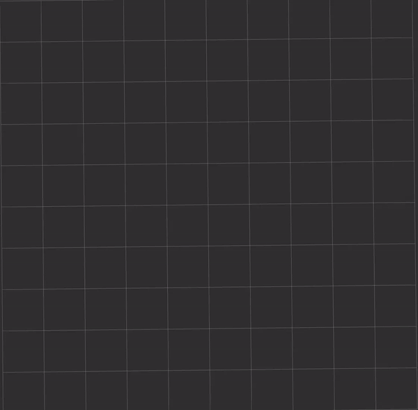

# ROS2 Curve Planners

This repository contains a collection of curve planning algorithms implemented in ROS2. An action server is also implemented
 that allows you to load multiple planners and send goals to them.

## Installation

To use the curve planners in your ROS2 environment, follow these steps:

1. Clone this repository into your ROS2 workspace:

   ```
   cd <your_ros2_workspace>/src
   git clone <repository_url>
   ```

2. Build the ROS2 workspace:

   ```
   cd <your_ros2_workspace>
   colcon build
   ```

3. Source the workspace:

   ```
   source <your_ros2_workspace>/install/setup.bash
   ```

## Demo


An Rviz demo is available in this repository. You can run it to visualize and test the implemented curve planner. 

To launch the Rviz demo, execute the following command:

```
ros2 launch curve_planners rviz_demo.launch.py 
```

In the Rviz window, you can use the "2D Pose Estimate" tool to set the start pose and optionally set waypoints using the same tool. Use the "2D Goal Pose" tool to set the goal pose for the planner.

You can configure the planner parameters from the `curve_planners/params/params.yaml` file.

## Available Curve Planners

Currently, only the Dubins curve planner is implemented. More curve planners will be added in the future.

## License

This project is licensed under the [MIT License](LICENSE).

